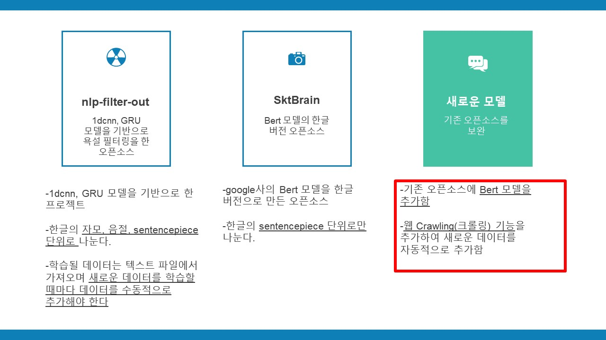
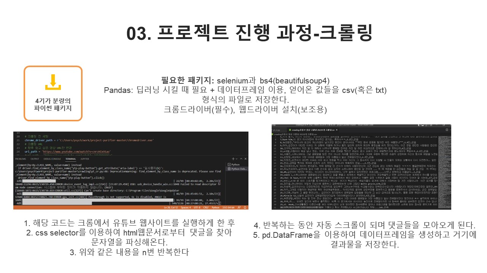
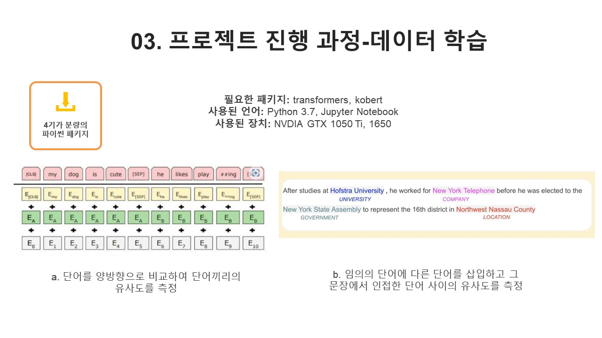
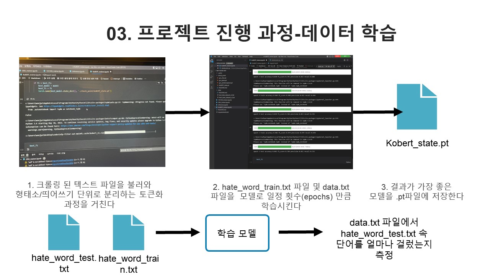
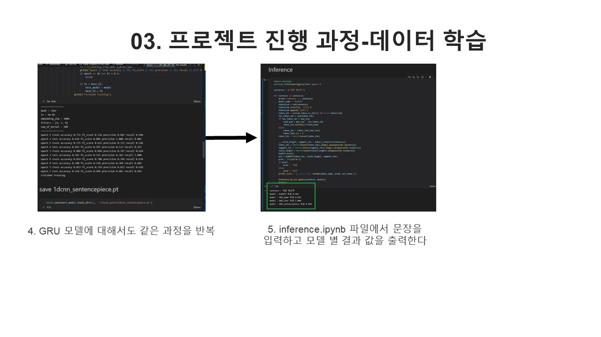
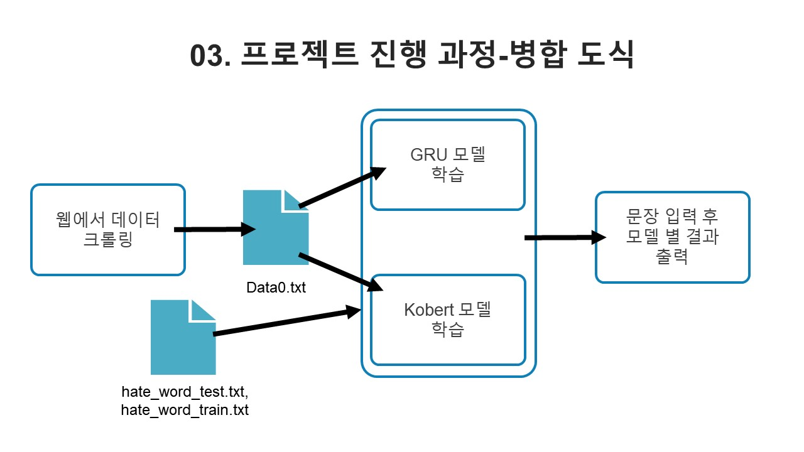
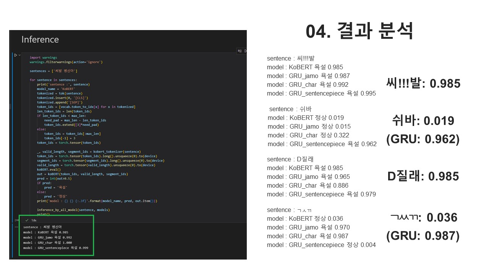
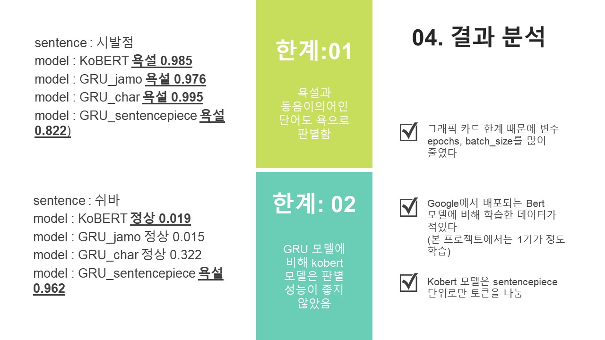

개요
============
자연어처리 분야는 기존 통계기반 모델에서 발전해왔으며, 요즈음에는 딥러닝을 통하여 좋은 성능을 달성하고 있다. 하지만, 딥러닝 모델의 높은 성능을 위해서는 대용량의 학습 데이터셋이 필요로 하기 마련이다. 이때, 무분별한 데이터 수집 속 욕설 및 폭언과 같은 데이터들은 모델의 성능을 저하할 수 있으며, 더 나아가 윤리적인 문제가 발생할 수 있다. 또한 윤리적 문제 뿐만 아니라 외국인 입장에서 욕설을 판단해줄 수 있는 서비스가 필요함을 느꼈다. 이 프로젝트는 수집된 한국어 데이터에서 욕설 및 폭언이 담긴 데이터를 제외하는 모델을 구축하고자 한다.

본 프로젝트에서는 한국어에 맞는 여러 토큰화 방법을 비교하며 적합한 토큰화 방법을 찾아내고 추가적으로, Computer Vision에 주로 쓰이는 CNN 모델의 자연어처리 접목 가능성을 실험하고자 한다. 이에 비교 모델로, SKT의 KoBERT 모델과 RNN계열중 하나인 GRU 모델을 함께 실험하며 결과를 비교해보고자 한다.

기존의 욕설 필터링 프로젝트와 다른 점은 GRU 모델과 kobert 모델을 함께 사용한다는 점과, 웹 크롤링 코드를 추가하여 해당 모델이 학습에 필요한 데이터를 자동적으로 추가해주는 기능이 있다는 것이다. 신조어가 자주 나타나는 요즘, 구글사의 bert 라이브러리와 직접적인 성격이 강한 크롤링을 함께 사용한다면 다양한 단어에 대한 분석이 더욱 원활해질 것이라고 판단하였다.

_동국대학교 공개소프트웨어 소속 팀 '다국적 기업'에서 프로젝트를 진행하였으며_  
_yeonsikch님의 nlp-filter-out/SKTBrain님의 kobert 프로젝트를 기반으로 하였습니다_

프로젝트 진행 절차
===============

개발 환경
==========
파이썬 패키지
----------
argon2-cffi         20.1.0
async-generator     1.10
attrs               21.2.0
backcall            0.2.0
bleach              3.3.0
boto3
certifi             2020.12.5
cffi                1.14.5
chardet             4.0.0
click               8.0.1
cycler              0.10.0
Cython              0.29.23
decorator           5.0.9
defusedxml          0.7.1
entrypoints         0.3
filelock            3.0.12
flatbuffers         2.0
future              0.18.2
gluonnlp            0.10.0
graphviz            0.8.4
huggingface-hub     0.0.8
idna                2.10
importlib-metadata  4.0.1
ipykernel           5.5.5
ipython             7.23.1
ipython-genutils    0.2.0
ipywidgets          7.6.3
jamotools           0.1.10
jedi                0.18.0
Jinja2              3.0.1
joblib              1.0.1
jsonschema          3.2.0
jupyter             1.0.0
jupyter-client      6.1.12
jupyter-console     6.4.0
jupyter-core        4.7.1
jupyterlab-pygments 0.1.2
jupyterlab-widgets  1.0.0
kiwisolver          1.3.1
kobert              0.1.2
MarkupSafe          2.0.1
matplotlib          3.4.2
matplotlib-inline   0.1.2
mistune             0.8.4
mxnet               1.8.0.post0
nbclient            0.5.3
nbconvert           6.0.7
nbformat            5.1.3
nest-asyncio        1.5.1
notebook            6.4.0
numpy               1.20.3
onnxruntime         1.8.0
packaging           20.9
pandas              1.2.4
pandocfilters       1.4.3
parso               0.8.2
pexpect             4.8.0
pickleshare         0.7.5
Pillow              8.2.0
pip                 21.0.1
prometheus-client   0.10.1
prompt-toolkit      3.0.18
protobuf            3.17.3
ptyprocess          0.7.0
pycparser           2.20
Pygments            2.9.0
pyparsing           2.4.7
pyrsistent          0.17.3
python-dateutil     2.8.1
pytz                2021.1
pyzmq               22.0.3
qtconsole           5.1.0
QtPy                1.9.0
regex               2021.4.4
requests            2.25.1
sacremoses          0.0.45
scikit-learn        0.24.2
scipy               1.6.3
Send2Trash          1.5.0
sentencepiece       0.1.91
setuptools          52.0.0.post20210125
six                 1.16.0
sklearn             0.0
terminado           0.10.0
testpath            0.5.0
threadpoolctl       2.1.0
tokenizers          0.10.3
torch               1.8.1
tornado             6.1
tqdm                4.61.0
traitlets           5.0.5
transformers        4.6.1
typing-extensions   3.10.0.0
urllib3             1.26.5
wcwidth             0.2.5
webencodings        0.5.1
wheel               0.36.2
widgetsnbextension  3.5.1
zipp                3.4.1

컴퓨터 사양
-----------
Geforce GTX 1650 ti, 1050
CUDA 10.2/11.3
16
